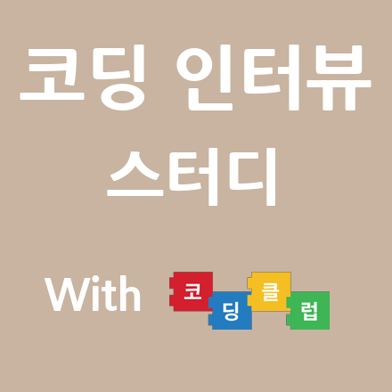

<html lang="ko">
 <head></head>
 <body>

<b>모임명 :</b> 코딩 인터뷰 스터디 with 코딩클럽

<b>코딩 클럽과의 관계
:</b> with 코딩클럽이라고 표시는 해놨지만, 현재 코딩클럽에서 진행하는 알고리즘 스터디와는 방향이 조금 다를수
있습니다. 코딩클럽의 교육과정을 참조해서 좀 더 인터뷰 대비에 집중하는 스터디를 만들고자 합니다. 모든 모임의 내용들은
코딩클럽과 공유할 예정입니다. &nbsp;

<b>스터디 레벨 :</b>
초급 ( 꼭 해당 학과/부를 졸업하여 자료구조 및 알고리즘 수업을 듣지 않았더라도, 주제가 주어지면 참고자료(인터넷
등)을 통해 검색해보고 스스로 시도해 보는 열정이 있는 분이면 됩니다. )&nbsp;

<b>기획 의도 :</b>
나프다(‘나는 프로그래머다') 팟캐스트 시청중에 알고리즘/자료구조 혹은 PS(Problem Solving) 을 공부할 때
‘혼자보다는 여럿이 함께 하는게 재미있다' 라는 말에 시도해보았습니다.&nbsp;

<b>목적 :</b>
“생각”과 “토론”을 반복하여 어렵게 보였던 알고리즘 이론 및 적용을 익숙하게 만들기. 배우거나 알고 있는 사실들을 말로
표현하는 커뮤니케이션 스킬 습득.&nbsp;

<b>대상 :</b> 코딩
인터뷰(혹은 기술면접)을 대비하고 싶은데 함께 할 사람이 필요한 사람. 알고리즘 및 자료구조를 공부하고, 토론 및
Critical Thinking을 하고 싶어하는 사람.&nbsp;

<b>기간 :</b> 5월
3일 ~ 7월 1일까지 매주 수/금. 각자 스터디해온 자료구조/알고리즘에 대한 인터뷰 형식의 발표 및
피드백.&nbsp;

<b>장소 :</b> 강남에
위치한 큰 규모의 카페 인원이 소규모이므로 회의실이나 스터디룸을 빌리기 보단 카페를 활용하려 합니다. 스터디원들이 원하는
방향에 따라 장소는 조정할 예정입니다.&nbsp;

<b>시간 :</b> 매주
수/금요일 오후 1시 ~ 오후 5시&nbsp;

<b>진행 방식 :</b>
자료구조/알고리즘 한가지(혹은 두가지)씩 맡아 공부해와서 인터뷰 방식으로 발표할 예정입니다. 모든 자료구조를 개인당
한번씩 발표한 뒤, 알고리즘으로 넘어가 동일한 방식으로 진행할 예정입니다.&nbsp;

<b>신청 방법 :</b>
OnOffMix 통해 신청 해주시면 됩니다. 본 스터디는 코딩클럽과 함께 프로그램입니다. 코딩클럽 그룹 가입 및 페이지
좋아요를 해주시면 감사하겠습니다.&nbsp;

&nbsp; &nbsp;
&nbsp;코딩클럽 그룹에 가입 https://<a href="http://www.facebook.com/groups/CodingClubKorea/">www.facebook.com/groups/CodingClubKorea/</a>&nbsp;

&nbsp; &nbsp;
&nbsp;코딩클럽 페이지 좋아요 <a href="http://facebook.com/codingclubs">http://facebook.com/codingclubs</a>&nbsp;

<b>스터디 그룹 크기
:</b> 최대 4명.&nbsp;

<b>참고 :</b>
스터디로와 관련된 공부 자료 및 사진은 페이스북 “코딩클럽"에 1차적으로 공유 되며, 그 외에 개인적으로 공유하거나 사용
하는데 무방한다는 전제입니다!&nbsp;

<b>비용 :</b>
무료(But, 유료 세미나실/스터디룸 대여시 1/N으로 분할)&nbsp;

<b>스터디 상세
진행&nbsp;</b>

&nbsp; &nbsp;
&nbsp; &nbsp; &nbsp; 5월 1~2주차 자료구조: 배열, 리스트, 스택, 큐&nbsp;

&nbsp; &nbsp;
&nbsp; &nbsp; &nbsp; &nbsp; &nbsp; &nbsp; &nbsp; &nbsp; &nbsp;
&nbsp; &nbsp; &nbsp; &nbsp;알고리즘: 버블 정렬, 삽입 정렬, 선택 정렬, 퀵
정렬&nbsp;

&nbsp; &nbsp;
&nbsp; &nbsp; &nbsp; 5월 3~4주차 자료구조: 트리&nbsp;

&nbsp; &nbsp;
&nbsp; &nbsp; &nbsp; &nbsp; &nbsp; &nbsp; &nbsp; &nbsp; &nbsp;
&nbsp; &nbsp; &nbsp; &nbsp;알고리즘: 이진 검색트리, DFS, BFS&nbsp;

&nbsp; &nbsp;
&nbsp; &nbsp; &nbsp; 6월 1~2주차 자료구조: 그래프&nbsp;

&nbsp; &nbsp;
&nbsp; &nbsp; &nbsp; &nbsp; &nbsp; &nbsp; &nbsp; &nbsp; &nbsp;
&nbsp; &nbsp; &nbsp; &nbsp;알고리즘: A*알고리즘, Network Flow, 위상정렬, 다익스트라
알고리즘&nbsp;

&nbsp; &nbsp;
&nbsp; &nbsp; &nbsp; 6월 3~4주차 자료구조: 미정&nbsp;

&nbsp; &nbsp;
&nbsp; &nbsp; &nbsp; &nbsp; &nbsp; &nbsp; &nbsp; &nbsp; &nbsp;
&nbsp; &nbsp; &nbsp; &nbsp;알고리즘: 미정&nbsp;

&nbsp; &nbsp;1.
각각의 참여 인원은 본인이 맡은 부분에 대한 자료를 정리해서 “초안"을 공유합니다.&nbsp;

&nbsp; &nbsp;2.
본인이 남에게 발표하는 방식이지만, 작성된 초안을 토론을 통해 스터디원이 함께 내용을 추가 및 보완해 나가며 모두가 같이
공부하는 것에 초점을 맞춥니다.&nbsp;

&nbsp; &nbsp;3.
초반 스터디 리딩은 제가 하며, 차후 리딩에 적합하시거나 자원을 받아 선정토록 하겠습니다.&nbsp;

&nbsp; &nbsp;4.
개개인은 미리 초안을 보고 스스로 overview를 통해서 스터디 당일날 좀 더 적극적으로 참여하여 듣기만하는 수업이
아닌 초안을 같이 완성한다는 생각으로 스터디를 합니다.&nbsp;

&nbsp; &nbsp;5.
추가적으로 챕터와 관련된 코딩이 필요하다고 생각 될 시에는 실제로 코드를 짜보는 시간도 갖게 될
예정입니다.&nbsp;

&nbsp; &nbsp;6.
기초 지식이 없는 상태에서 스터디를 진행하는 관계상, 서로 많이 부족하고 벅찰 수 있습니다. 계속적으로 서로서로 질문을
통하여 도울 수 있도록 하는데 주안점을 두었습니다.&nbsp;

&nbsp; &nbsp;7.
마지막 주차는 스터디 진행 사항에 따라 결정될 예정입니다.

</body>
<html>
